# LogTrawl v1.0.0 🚀


专业的日志文件分析工具

LogTrawl 是一个基于 Wails v2 框架开发的现代化桌面日志分析工具，提供强大的日志查看、搜索、过滤和分析功能。

[功能特性](#-功能特性) • [快速开始](#-快速开始) • [使用指南](#-使用指南) • [快捷键](#-快捷键) • [贡献](#-贡献)

---

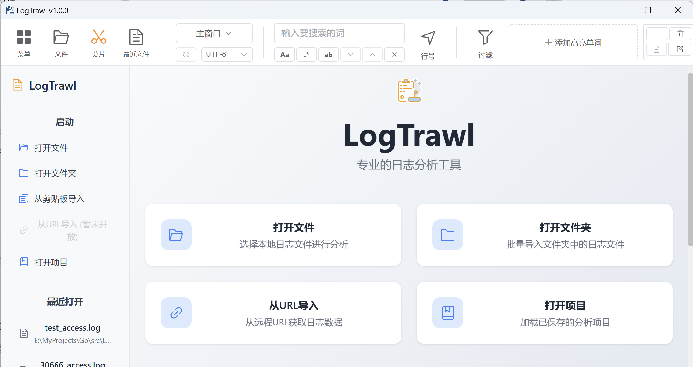


## ✨ 功能特性

### 🔍 强大的搜索与过滤

- **智能搜索**: 支持正则表达式、大小写敏感、全词匹配
- **实时过滤**: 创建多个过滤窗口，支持复杂的逻辑表达式
- **快速过滤**: 选中文本按 `F` 键快速创建过滤器
- **过滤示例**: 内置丰富的过滤表达式示例

### 🎨 可视化与高亮

- **语法高亮**: 自动识别日志格式并高亮显示关键信息
- **自定义高亮**: 选中文本按 `E` 键添加自定义高亮词
- **多色彩标记**: 支持多种颜色的高亮标记
- **行号显示**: 可切换的行号显示功能

### 📊 数据分析

- **统计分析**: IP地址、URL、状态码等统计分析
- **图表展示**: 使用 ECharts 生成可视化图表
- **时间线功能**: 标记重要日志条目，按 `T` 键快速添加
- **流程图**: 支持 Mermaid 流程图展示

### 🛠️ 实用工具

- **文件分片**: 大文件智能分片，支持按大小、行数、时间分割
- **项目管理**: 保存和恢复工作状态，包括过滤器和高亮设置
- **多文件支持**: 同时打开和分析多个日志文件
- **导出功能**: 导出过滤结果和分析报告

### 🎯 用户体验

- **响应式界面**: 适配不同屏幕尺寸，小窗口智能收纳功能
- **快捷键操作**: 丰富的快捷键支持，提高操作效率
- **拖拽支持**: 支持拖拽文件打开
- **最近文件**: 快速访问最近打开的文件

## 🛠️ 技术栈

- **后端**: Go 1.21+ + Wails v2 框架
- **前端**: Vue 3 + TypeScript + Element Plus + Pinia
- **图表**: ECharts 5.6+ + Mermaid 11.9+
- **构建**: Vite 4.x + Vue-tsc
- **桌面**: 跨平台桌面应用程序 (Windows/macOS/Linux)

## 🚀 快速开始

### 📋 系统要求

- **操作系统**: Windows 10+, macOS 10.13+, Linux (Ubuntu 18.04+)
- **开发环境**: Go 1.21+, Node.js 16+
- **内存**: 建议 4GB+ RAM
- **存储**: 100MB+ 可用空间

### 🔧 开发环境搭建

1. **安装依赖**

   ```bash
   # 安装 Go (https://golang.org/dl/)
   # 安装 Node.js (https://nodejs.org/)
   
   # 安装 Wails CLI
   go install github.com/wailsapp/wails/v2/cmd/wails@latest
   ```

2. **克隆项目**

   ```bash
   git clone https://github.com/onewinner/LogTrawl.git
   cd LogTrawl
   ```

3. **安装前端依赖**

   ```bash
   cd frontend
   npm install
   cd ..
   ```

4. **运行开发模式**

   ```bash
   wails dev
   ```

### 📦 构建生产版本

```bash
# 构建所有平台
wails build

# 构建特定平台
wails build -platform windows/amd64
wails build -platform darwin/amd64
wails build -platform linux/amd64
```

构建完成后，可执行文件位于 `build/bin/` 目录下。

### 🎯 快速体验

1. 下载预编译版本 (推荐)
2. 解压并运行 `LogTrawl.exe` (Windows) 或 `LogTrawl` (Linux/macOS)
3. 拖拽日志文件到应用窗口或点击"打开文件"按钮
4. 开始分析你的日志！

## 📖 使用指南

### 📁 打开日志文件

| 方式         | 操作                 | 说明         |
| ------------ | -------------------- | ------------ |
| **拖拽打开** | 直接拖拽文件到窗口   | 最快捷的方式 |
| **菜单打开** | 点击工具栏"文件"按钮 | 支持多选     |
| **文件夹**   | 侧边栏"打开文件夹"   | 批量导入     |
| **最近文件** | 侧边栏"最近打开"     | 快速访问     |

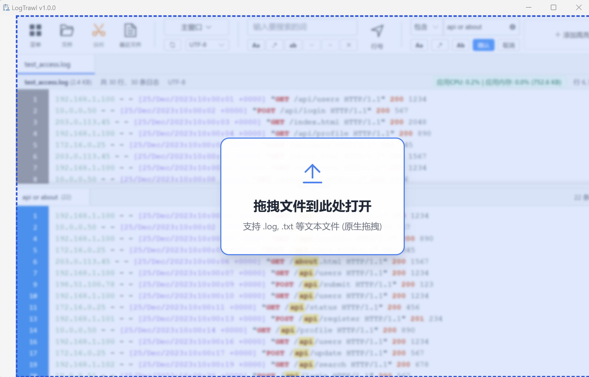

### 🔍 搜索和过滤

#### 基础搜索

- 在顶部搜索框输入关键词
- 使用 `↑` `↓` 键或按钮导航结果
- 支持实时搜索和结果高亮

#### 高级搜索选项

| 选项           | 图标 | 功能             |
| -------------- | ---- | ---------------- |
| **正则表达式** | `.*` | 支持复杂模式匹配 |
| **大小写敏感** | `Aa` | 区分大小写       |
| **全词匹配**   | `Ab` | 完整单词匹配     |

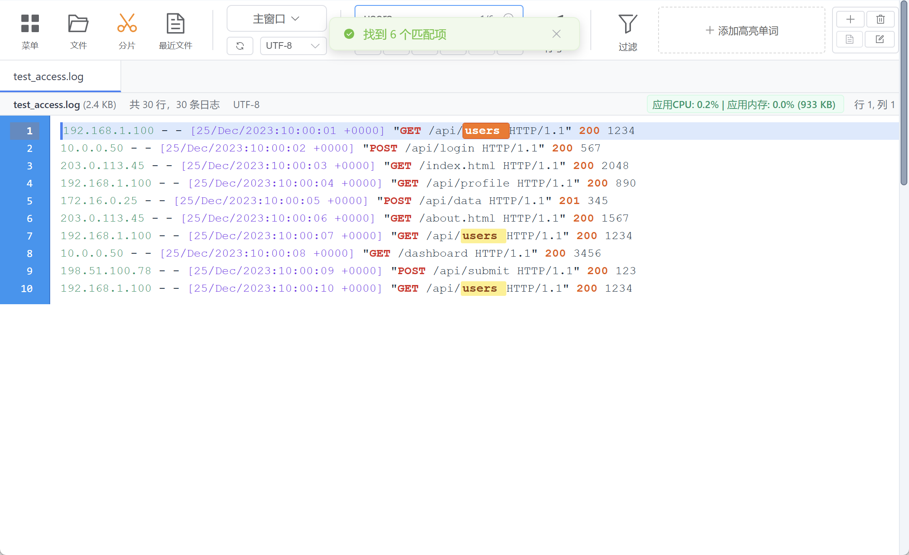

#### 智能过滤

```bash
# 基础过滤
error                    # 包含 "error" 的行

# 逻辑操作
error AND 404           # 同时包含两个关键词
error OR warning        # 包含任一关键词
(GET OR POST) AND /api/ # 复合条件

# 实际应用
(error OR warning) AND 404                    # 错误信息且404状态
login && (success || failed)                 # 登录相关记录
(GET || POST) AND /api/ AND (200 OR 201)    # API成功响应
```

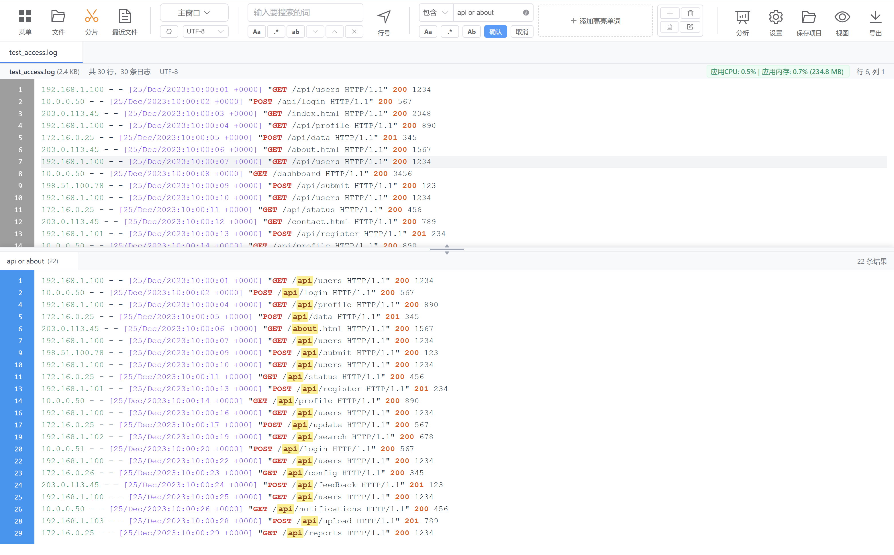

### 🎨 高亮和标记

#### 自定义高亮

1. **选中文本** → 按 `E` 键 → 自动添加高亮
2. 支持多种颜色自动分配
3. 可在工具栏管理高亮词

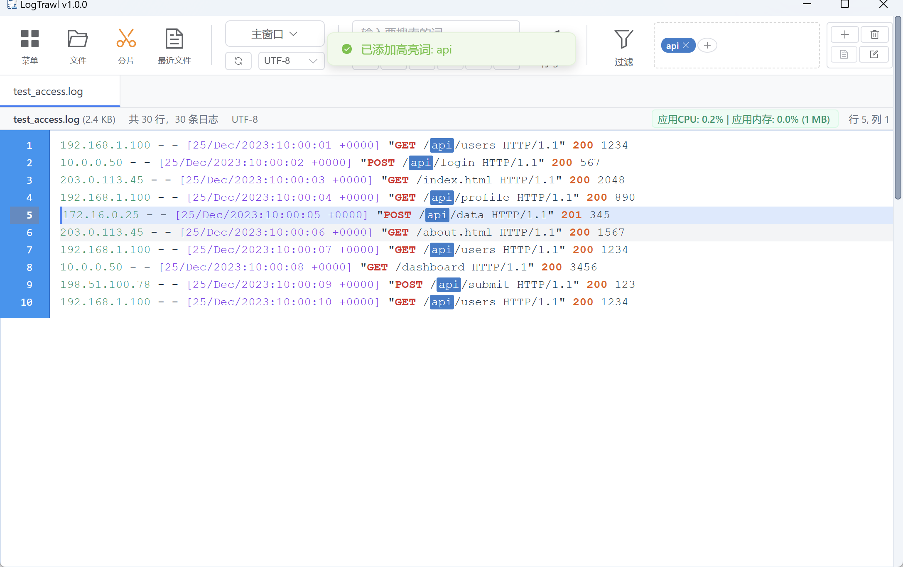

#### 时间线标记

1. **点击日志行** → 按 `T` 键 → 添加到时间线
2. 在时间线面板查看和管理标记
3. 支持添加备注和跳转

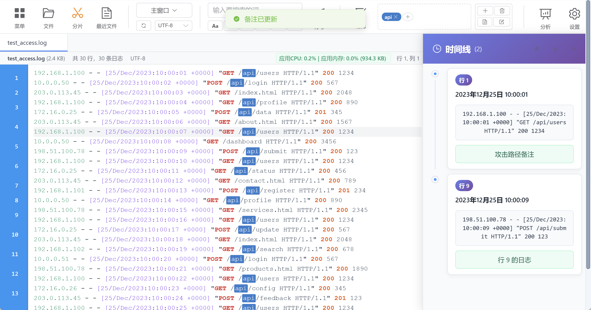

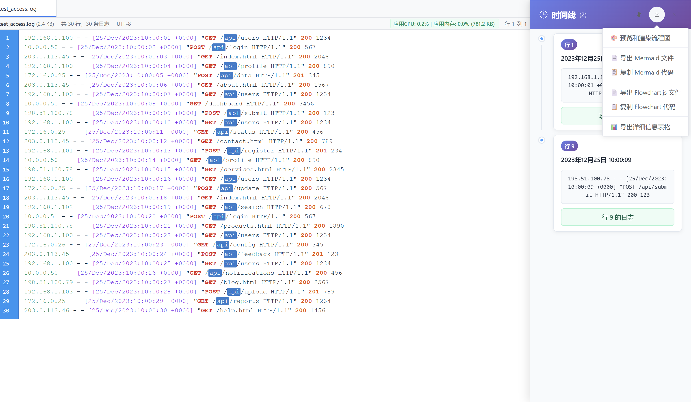

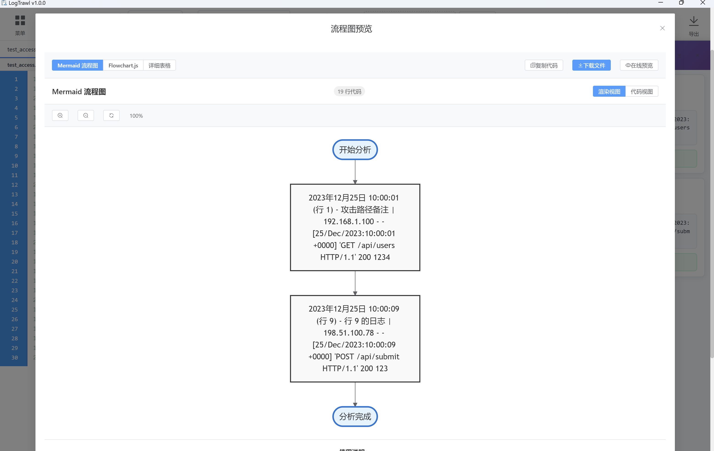

### 📊 数据分析

#### 统计分析

- **IP 分析**: 访问频率
- **URL 分析**: 热门页面
- **状态码**: 错误率统计
- **时间分布**: 访问模式分析

#### 可视化图表

- 柱状图、饼图、折线图
- 支持交互式图表操作
- 可导出图表为图片

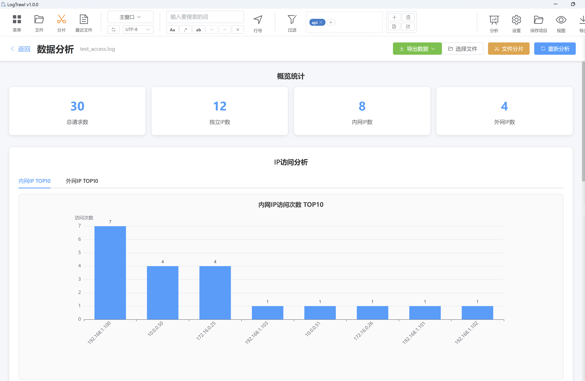

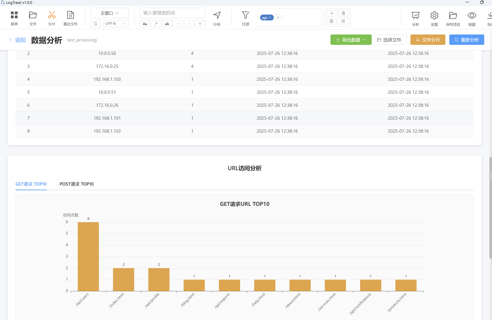

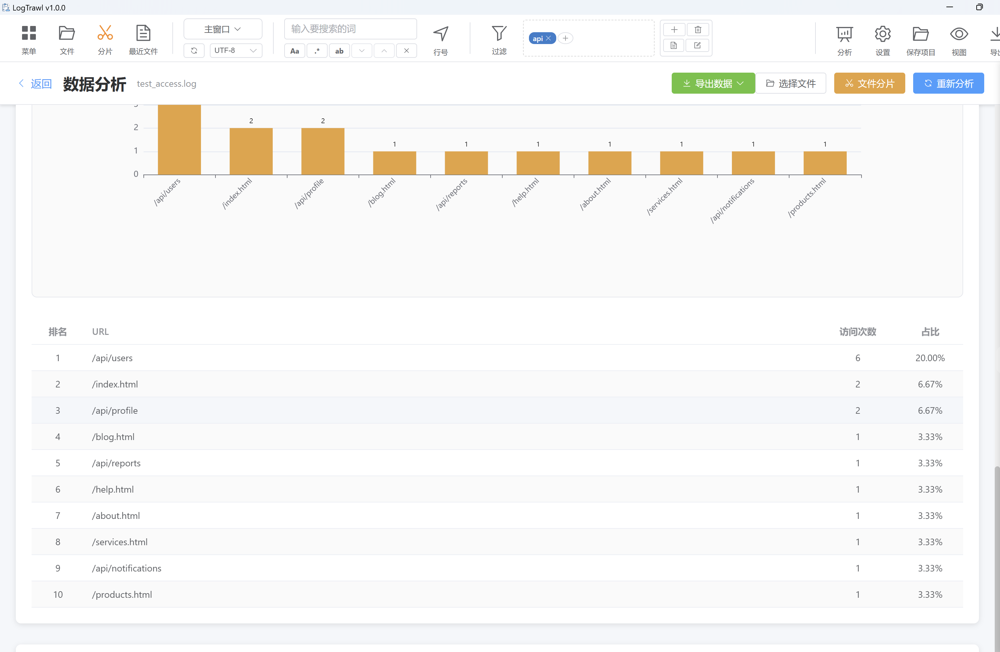

### 🛠️ 实用工具

#### 文件分片

1. 点击工具栏"分片"按钮
2. 选择分片方式：
   - **按大小**: 每片固定大小
   - **按行数**: 每片固定行数
   - **按时间**: 按时间段分割
3. 设置输出目录和文件名格式

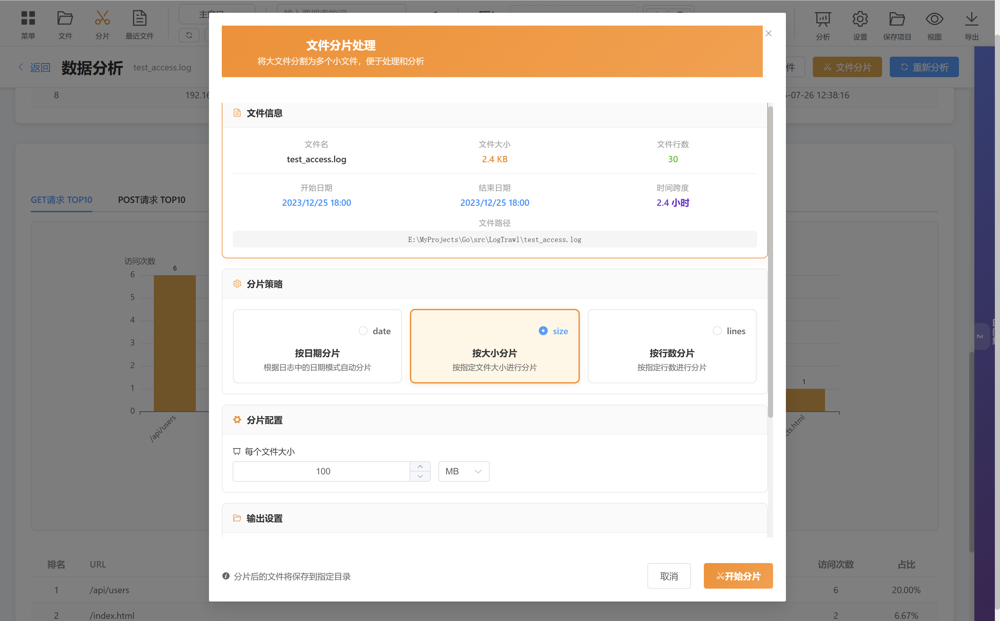

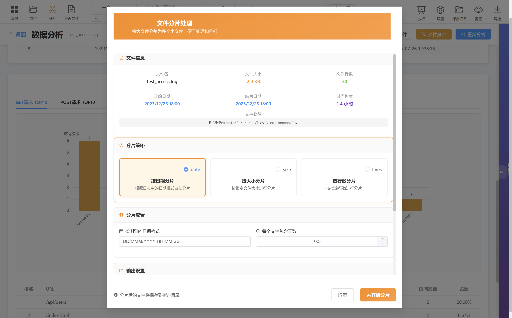

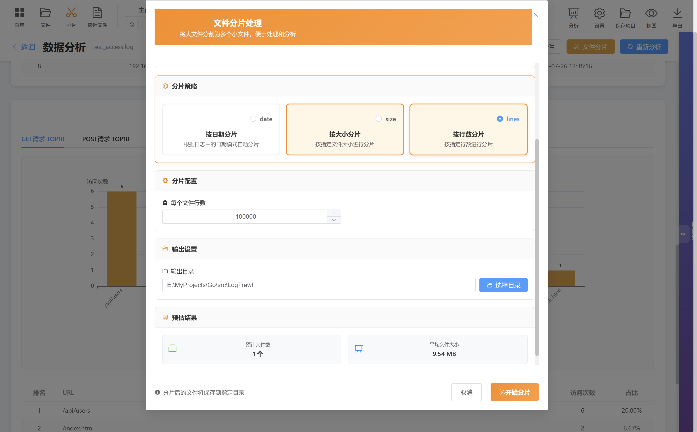

#### 项目管理

- **保存项目**: 保存当前工作状态
- **加载项目**: 恢复之前的工作环境
- 包含：过滤器、高亮词、时间线等

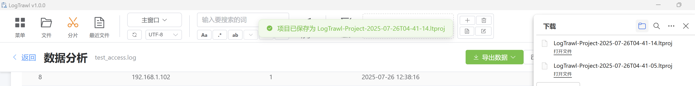

### ⚙️ 设置选项

#### 显示设置

- **字体**: 大小、字体族
- **编码**: UTF-8、GBK等
- **行距**: 可调节行高
- **显示选项**: 行号、自动换行、语法高亮

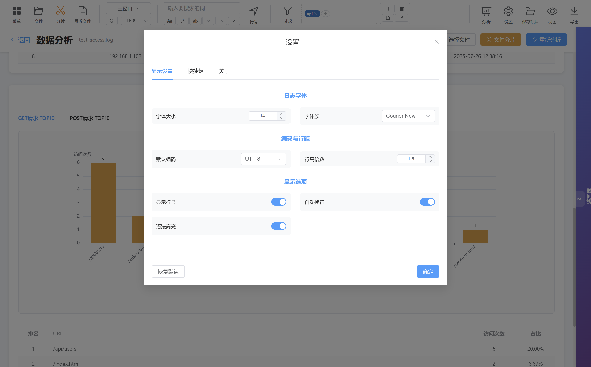

#### 快捷键设置

查看完整的快捷键列表和使用技巧

## 📋 支持的日志格式

### 🌐 Web 服务器日志

```bash
# Apache Common Log Format
127.0.0.1 - - [10/Oct/2000:13:55:36 -0700] "GET /apache_pb.gif HTTP/1.0" 200 2326

# Nginx Access Log
192.168.1.1 - - [25/Dec/2023:10:00:01 +0000] "GET /index.html HTTP/1.1" 200 1024 "-" "Mozilla/5.0"

# Combined Log Format
127.0.0.1 - frank [10/Oct/2000:13:55:36 -0700] "GET /apache_pb.gif HTTP/1.0" 200 2326 "http://www.example.com/start.html" "Mozilla/4.08"
```

### 📱 应用程序日志

```bash
# 标准应用日志
2023-12-25 10:00:01 INFO  [main] Application started successfully
2023-12-25 10:00:02 WARN  [worker-1] Connection timeout, retrying...
2023-12-25 10:00:03 ERROR [worker-2] Database connection failed

# JSON 格式日志
{"timestamp":"2023-12-25T10:00:01Z","level":"INFO","message":"User login","user_id":12345}
```

### 🖥️ 系统日志

```bash
# Syslog 格式
Dec 25 10:00:01 server01 sshd[1234]: Accepted password for user from 192.168.1.100

# Windows Event Log
2023-12-25 10:00:01 Information Microsoft-Windows-Security-Auditing Logon success
```

### 🔧 自定义格式

- 支持自定义正则表达式解析
- 灵活的字段映射配置
- 可扩展的语法高亮规则

## ⌨️ 快捷键

### 🎨 高亮操作

| 快捷键 | 功能       | 说明              |
| ------ | ---------- | ----------------- |
| `E`    | 添加高亮词 | 选中文本后按 E 键 |

### ⏰ 时间线操作

| 快捷键 | 功能           | 说明                |
| ------ | -------------- | ------------------- |
| `T`    | 快速添加时间线 | 点击日志行后按 T 键 |

### 🔍 过滤操作

| 快捷键 | 功能     | 说明              |
| ------ | -------- | ----------------- |
| `F`    | 快速过滤 | 选中文本后按 F 键 |

### 📋 文本操作

| 快捷键     | 功能             | 说明             |
| ---------- | ---------------- | ---------------- |
| `Ctrl + A` | 全选当前窗口文本 | 选择所有可见内容 |

### 💡 使用技巧

- **高亮词**: 选中任意文本后按 E 键即可快速添加高亮，支持多种颜色自动分配
- **时间线**: 点击日志行使其获得焦点，然后按 T 键可快速添加到时间线
- **过滤**: 选中关键词后按 F 键可快速创建包含该词的过滤窗口
- **窗口切换**: 可在主窗口和过滤窗口之间切换，快捷键在各窗口中都有效

## 🤝 贡献指南

我们欢迎所有形式的贡献！无论是 bug 报告、功能请求、代码贡献还是文档改进。

### 🔧 后续开源

1. Star 500+根据情况开源

### 🐛 报告 Bug

1. 在 [Issues](https://github.com/onewinner/LogTrawl/issues) 页面创建新的 issue
2. 使用 Bug 报告模板
3. 提供详细的复现步骤和环境信息

### 💡 功能请求

1. 在 [Issues](https://github.com/onewinner/LogTrawl/issues) 页面创建新的 issue
2. 使用功能请求模板
3. 详细描述期望的功能和使用场景

### 🔧 代码贡献

1. Fork 本仓库
2. 创建功能分支: `git checkout -b feature/amazing-feature`
3. 提交更改: `git commit -m 'Add amazing feature'`
4. 推送到分支: `git push origin feature/amazing-feature`
5. 创建 Pull Request

---


## 版本更新日志


### v1.0.0 (2025-08-03) 🎉

**🎯** **首个正式版本发布**

#### 🔍 核心功能

- **智能日志查看器**: 支持大文件快速加载和分块处理
- **高级搜索引擎**: 正则表达式、大小写敏感、全词匹配
- **实时过滤系统**: 支持复杂逻辑表达式 (AND/OR/括号分组)
- **语法高亮**: 自动识别日志格式，支持时间、IP、状态码等高亮

#### 🎨 可视化功能

- **自定义高亮**: 多色彩标记系统，支持快捷键操作
- **时间线标注**: 重要日志条目标记和备注功能
- **数据分析图表**: 基于 ECharts 的统计可视化
- **流程图支持**: 集成 Mermaid 图表展示

#### 🛠️ 实用工具

- **文件分片器**: 按大小、行数、时间智能分割大文件
- **项目管理**: 保存和恢复完整工作状态
- **多文件支持**: 标签页式文件管理
- **导出功能**: 支持过滤结果和分析报告导出

#### 🎯 用户体验

- **响应式界面**: 适配不同屏幕尺寸，智能按钮收纳
- **快捷键系统**:

- `E` - 添加高亮词
- `T` - 快速添加时间线
- `F` - 快速过滤
- `Ctrl+A` - 全选文本

- **右键菜单**: 上下文感知的智能菜单
- **拖拽支持**: 文件拖拽打开

#### 📊 数据分析

- **IP 分析**: 访问频率统计和地理分布
- **URL 分析**: 热门页面和响应时间分析
- **状态码统计**: 错误率和成功率分析
- **时间分布**: 访问模式和趋势分析

#### 🔧 技术特性

- **大文件优化**: 支持 GB 级文件的流畅操作
- **内存管理**: 智能分块加载和内存清理
- **性能监控**: 实时系统资源监控
- **多格式支持**: Web服务器日志、应用日志、系统日志

#### 🎨 界面优化

- **现代化设计**: Element Plus UI 组件库
- **主题一致性**: 统一的视觉风格和交互体验
- **设置系统**: 完整的个性化配置选项
- **多语言准备**: 国际化架构支持

#### 🚀 性能提升

- **异步加载**: 非阻塞的文件处理
- **虚拟滚动**: 大数据量的流畅滚动
- **缓存机制**: 智能数据缓存策略
- **并发处理**: 多线程文件分析

#### 📱 跨平台支持

- **Windows**: 完整功能支持
- **macOS**: 原生体验（未测试）
- **Linux**: 全平台兼容（未测试）

**⭐ 如果这个项目对你有帮助，请给它一个 Star！**

## 参考链接

[compilelife/loginsight: loginsight致力于打造一款日志分析的利器](https://github.com/compilelife/loginsight)

## 作者

Made with ❤️ by [onewin](https://github.com/onewinner)
欢迎关注作者公众号：


[](https://www.star-history.com/#onewinner/LogTrawl&Date)

